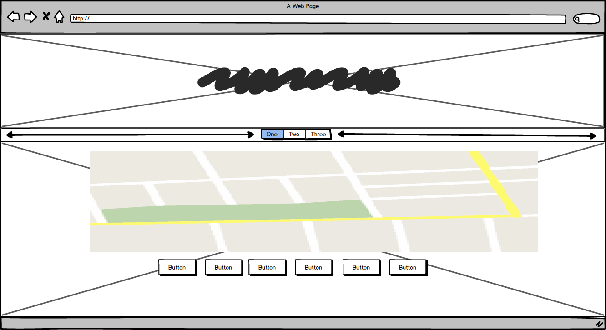
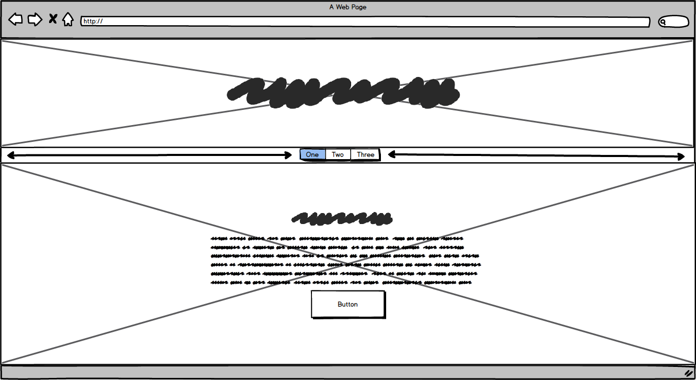

# Travel Helper

Welcome to the site and I hope you enjoy it. It's a simple idea for allowing you to locate your city on a map then use the buttons to view certain amenities when clicked. 
 
## UX
 
I created this project as a solution for two groups of people. The first being my older relatives who are not capable of using smartphones and the second group being those like myself who like to plan their
journey and become familiar with an area before they travel there. Or to decide whether it is a good place to travel based on what is in the area.

<h2>Wireframes</h2>

All wireframes were made using Balsamiq.

<h3>index.html</h3>

    

<h3>map.html</h3>

    

<h3>contact.html</h3>

    

<h2>User Stories</h2>

- As an older aged person I would find it difficult to operate a smartphone. While using this site I can access it from any PC and look for places to see in any possible destination
  this will save me time in a travel agents and I don't need to bother with any bulky paper maps. I can also save money by avoiding places that do not have all the facilities I would
  like in a holiday destination. Dan (74)
  
- I love to travel but I hate being outside my comfort zone. Before I travel I like to look at the place and familiarize myself with the area before I ever leave home. I am far more
  comfortable one I arrive and see things I recognise from the site. Amy (26)

This section is also where you would share links to any wireframes, mockups, diagrams etc. that you created as part of the design process. These files should themselves either be included as a pdf file in the project itself (in an separate directory), or just hosted elsewhere online and can be in any format that is viewable inside the browser.

<h2>Features</h2>

<h3>index.html</h3>
- On this page I just made a simple jumbotron with bootstrap and linked the button to my map.html page. The jumbotron gives a
  brief introduction and explanation as to how to operate the map.

<h3>map.html</h3>
- This page is where most of the functionality and purpose of the site is. I have udes google maps and places APIs in 
  conjunction with a searchbox and buttons. Users can use the searchbox to load their desired city, then use the below buttons
  to display all ATMs, Cafes, Restaurants, Grocery Stores, Attractions or Bars in the bounds of the map.

<h3>contact.html</h3>
- This is a fully functioning contact form that will send the user an email letting them know that their email has been received and sending me an
  email with the users message and contact details.
 
<h2>Existing Features</h2>
Global - The site has a navbar loaded from bootstrap linking to each page and the logo in the middle of the banner image as an anchor link to the homepage.

index.html - As the homepage this has a jumbotron with instrutions on how to use the map and a button to bring the user to the map page.

map.html - The map is fully functional and ingterated using places and maps APIs, users can search for their city then use the buttons to diplay selected amenities
in the area.

contact.html - This contact form is linked with EmailJS. It allows users to contact myself directly. It sends users and email letting them know that their email has 
been received and someone will be in contact shortly. I also receive an email with the users feedback and their name and contact details.

### Features Left to Implement
- I would like to have a wider selection of amenities that users can search for. The buttons do their job well and I am happy that they have displayed what I have
  learned thus far. However in the future I'd prefer some thing like a dropdown menu that won't take up as much real estate as buttons on the page.

## Technologies Used

- [JQuery](https://jquery.com)
    - The project uses **JQuery** to simplify DOM manipulation.

- [Bootstrap](https://getbootstrap.com/docs/4.1/getting-started/introduction/)
    - The project uses **Bootstrap** to simplify the design process.
    
- [Maps API](https://developers.google.com/maps) 
    - The project uses the **Maps API** to integrate a map into the page.
    
- [Places API](https://developers.google.com/places/web-service/intro)    
    - The project uses the **Places API** to add functionality to the map.
    
## Testing

1. Maps:
    1. Zoom map out to the max and try to use buttons.
    2. No markers will show up as the bounds are not within a city.

1. Contact form:
    1. Go to the "Contact Us" page
    2. Try to submit the empty form and verify that an error message about the required fields appears
    3. Try to submit the form with an invalid email address and verify that a relevant error message appears
    4. Try to submit the form with all inputs valid and verify that a success message appears.

## Deployment

I used GitHub pages to deploy my site.

### Content
- The text for section Y was copied from the [Wikipedia article Z](https://en.wikipedia.org/wiki/Z)

### Media
- The photos along with the marker icons used in this site were obtained from google images

### Acknowledgements

- I received inspiration for this project from a site called Map Of The Dead which is no longer active. It allowed user to look for
useful resources in the event of a zombie apocalypse and was implimented really well.
